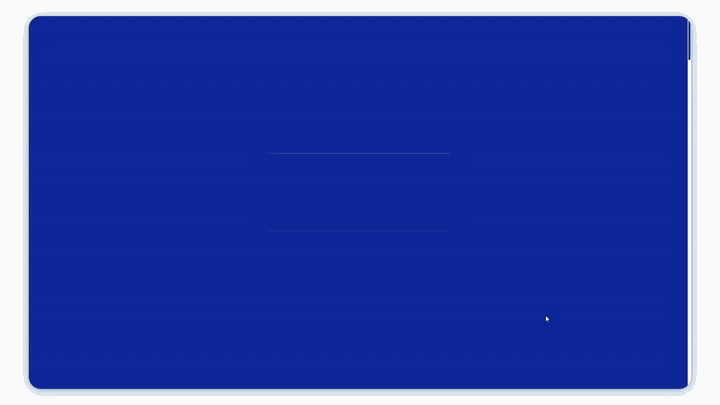

# botellho

<p align="center">
  <a href="https://botellho.com">
    
  </a>
</p>

<p align="center"><sub><a href="https://botellho.com"><strong>▸ abrir botellho.com</strong></a></sub></p>

<p align="center">
  <a href="https://botellho.com"></a>
  
  
  
  
  
</p>

<p align="center">
  <em>Portfólio pessoal de <strong>Mateus Botelho</strong>, desenvolvedor criativo.<br>
  O próprio site é a peça: interface 1-bit, linguagem de terminal, diorama 3D na home.</em>
</p>

```text
> botellho --boot
BOTELLHO MICROSYSTEMS .......................... BIOS v2.6
paleta 1-bit ................................... ok
diorama 3d + shaders proprios .................. ok
ban, o dachshund ............................... acordado
performance, acessibilidade, seo ............... ok
pronto. abrindo botellho.com
```

## Sobre

A maioria dos portfólios lista projetos. Este é o projeto. A proposta foi tratar a interface como uma obra em vez de uma vitrine: uma máquina antiga que liga na sua frente, com estética de dois tons, tipografia de bitmap e navegação de terminal. Cada página é um programa. A home é um diorama 3D onde o Ban, meu cachorro (um dachshund de verdade, modelado em 3D), circula pelo cenário.

A intenção nunca foi decorar. Foi demonstrar, no próprio meio, o tipo de trabalho que eu faço: engenharia e direção de arte tratadas como a mesma disciplina.

## Conceito

- A paleta é de duas cores, azul de fósforo e branco, na linguagem de um monitor CRT. Sem gradiente, sem sombra suave.
- A primeira visita abre com uma sequência de boot no estilo BIOS, com log e barra de progresso, antes de revelar o site.
- A navegação funciona como um terminal: um command palette responde à tecla `/`, e você digita para onde quer ir.
- As fotos que entram no site passam por dither Floyd-Steinberg de 1-bit, gerado no build, não por filtro de CSS.

## Por baixo

O centro técnico é o hero 3D. É um diorama em WebGL com React Three Fiber, renderizado por um pós-processamento de três shaders escritos à mão, em ordem obrigatória: contorno no estilo Moebius em resolução cheia, depois a pixelização retrô de 1-bit, depois a curvatura e as scanlines de um tubo CRT. O Ban tem esqueleto e animação próprios: ele caminha pelo cenário e abana o rabo.

O diorama é pesado, então não segura a primeira pintura. Ele vive num chunk separado, baixado só quando entra na viewport, e não carrega para quem pediu menos movimento ou está num aparelho limitado.

Do lado do conteúdo, tudo é pré-renderizado. Cada rota pública vira HTML real no build, então o texto chega pronto ao DOM e é indexável sem depender de JavaScript. Uma fonte única de rotas alimenta ao mesmo tempo o pré-render e o `sitemap.xml`, e os cases publicados entram lendo o banco no momento em que o site é construído. Os dados estruturados descrevem o site como uma pessoa, não uma empresa.

## Tecnologias

- Base: Vite, React, TypeScript
- Estilo: Tailwind CSS, shadcn/ui (Radix)
- 3D e shaders: Three.js, React Three Fiber, postprocessing
- Movimento: GSAP, Lenis
- Conteúdo e contato: Supabase, EmailJS, reCAPTCHA
- Render e SEO: vite-react-ssg (pré-render por rota), react-helmet-async
- Infraestrutura: GitHub Pages, GitHub Actions

## Créditos

Atribuições de terceiros (modelo 3D, fontes) em [CREDITS.md](CREDITS.md).
